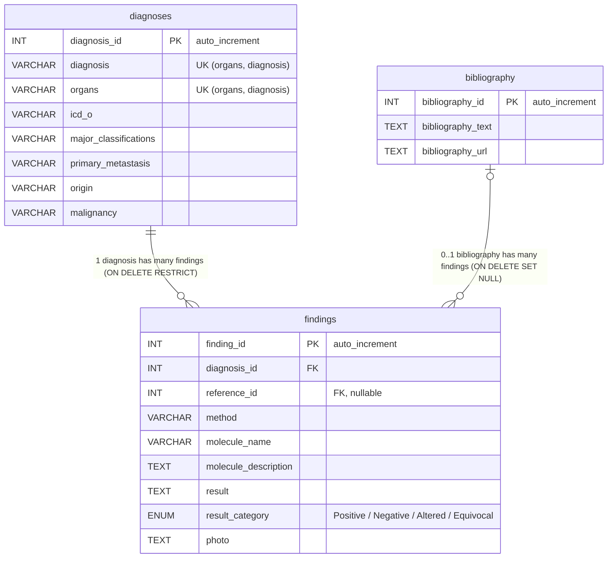

# evicoDB ER図

`mysql/init/schema.sql` の内容に基づく ER 図です。

- `diagnoses`（診断マスタ）1件に対し、`findings`（所見）が複数紐づく
- `findings` は `bibliography`（文献マスタ）を任意で参照する（`reference_id` は NULL 可）

## テーブル概要

| テーブル | 役割 | PK | FK |
| --- | --- | --- | --- |
| `diagnoses` | 診断マスタ | `diagnosis_id`（自動採番） | - |
| `bibliography` | 文献マスタ | `bibliography_id`（自動採番） | - |
| `findings` | 検査・所見（事実テーブル） | `finding_id`（自動採番） | `diagnosis_id` → `diagnoses`, `reference_id` → `bibliography`（NULL可） |

## カラム定義

### diagnoses（診断マスタ）

| カラム | 型 | NULL | 説明 |
| --- | --- | --- | --- |
| `diagnosis_id` | INT AUTO_INCREMENT | 不可 | 診断ID（自動採番） |
| `diagnosis` | VARCHAR(255) | 不可 | 診断名（例: Invasive mucinous adenocarcinoma） |
| `organs` | VARCHAR(100) | 不可 | 臓器（例: Lung） |
| `icd_o` | VARCHAR(20) | 可 | ICD-Oコード（例: 8253/3） |
| `major_classifications` | VARCHAR(255) | 可 | 大分類（例: Adenocarcinoma） |
| `primary_metastasis` | VARCHAR(50) | 可 | 原発/転移（Primary / Metastasis） |
| `origin` | VARCHAR(50) | 可 | 組織学的起源（例: Epithelial） |
| `malignancy` | VARCHAR(50) | 可 | 良悪性区分（Benign / Malignant など） |

### findings（診断ごとの検査・所見情報）

| カラム | 型 | NULL | 説明 |
| --- | --- | --- | --- |
| `finding_id` | INT AUTO_INCREMENT | 不可 | 所見ID（自動採番） |
| `diagnosis_id` | INT | 不可 | 対応する診断ID（diagnoses.diagnosis_id） |
| `reference_id` | INT | 可 | 参照文献ID（bibliography.bibliography_id） |
| `method` | VARCHAR(100) | 可 | 検査方法（IHC / Genetic test など） |
| `molecule_name` | VARCHAR(255) | 可 | 分子・マーカー名（例: TTF-1, CK7, KRAS mutation） |
| `molecule_description` | TEXT | 可 | 分子の説明・補足情報 |
| `result` | TEXT | 可 | 検査結果の記述（例: Positive, Negative, Positive, focal など） |
| `result_category` | ENUM(Positive, Negative, Altered, Equivocal) | 可 | 検査結果の判定（陽性 / 陰性 / 遺伝子異常あり / 判定困難） |
| `photo` | TEXT | 可 | 画像ファイル名またはパス |

### bibliography（文献マスタ）

| カラム | 型 | NULL | 説明 |
| --- | --- | --- | --- |
| `bibliography_id` | INT AUTO_INCREMENT | 不可 | 文献ID（自動採番） |
| `bibliography_text` | TEXT | 不可 | 文献情報（雑誌名・巻・ページ・年など） |
| `bibliography_url` | TEXT | 可 | 文献のURL（PubMedなど） |

## 補足

- `diagnoses` は「臓器 + 診断名」（`organs`, `diagnosis`）の組み合わせが重複しない。同じ診断名でも臓器が違えば別の診断として登録できる。
- `findings.diagnosis_id` は `NOT NULL`。診断削除時は `RESTRICT`（所見が残っている限り診断は削除不可）。
- `findings.reference_id` は `NULL` 可。文献参照が無い所見はこの値が `NULL`（`bibliography` にレコードを作らない）。文献削除時は `SET NULL`。
- `findings.result` は元の記述（例: `Positive, focal`）、`findings.result_category` はその判定（陽性 / 陰性 / 遺伝子異常あり / 判定困難）。
- DB には人が確認済みの所見だけを登録する。LLM による抽出結果の確認は DB の外（`annotator/output`）で行う。
