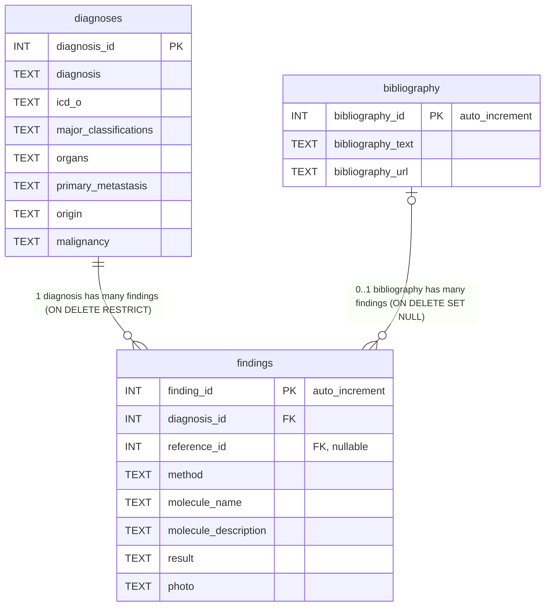

# evicoDB ER図

`mysql/init/schema.sql` の内容に基づく ER 図です。

- `diagnoses`（診断マスタ）1件に対し、`findings`（所見）が複数紐づく
- `findings` は `bibliography`（文献マスタ）を任意で参照する（`reference_id` は NULL 可）

## テーブル概要

| テーブル | 役割 | PK | FK |
| --- | --- | --- | --- |
| `diagnoses` | 診断マスタ | `diagnosis_id`（Excel由来ID、手動管理） | - |
| `bibliography` | 文献マスタ | `bibliography_id`（自動採番） | - |
| `findings` | 検査・所見（事実テーブル） | `finding_id`（自動採番） | `diagnosis_id` → `diagnoses`, `reference_id` → `bibliography`（NULL可） |

## 補足

- `findings.diagnosis_id` は `NOT NULL`。診断削除時は `RESTRICT`（所見が残っている限り診断は削除不可）。
- `findings.reference_id` は `NULL` 可。文献参照が無い所見はこの値が `NULL`（`bibliography` にレコードを作らない）。文献削除時は `SET NULL`。
